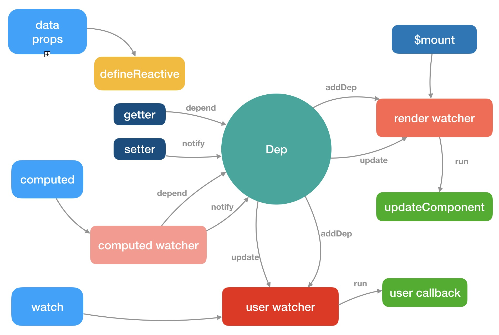

## 依赖收集
收集依赖的目的是为了当这些响应式数据发生变化，触发它们的 setter 的时候，能知道应该通知哪些订阅者去做相应的逻辑处理，我们把这个过程叫派发更新，其实 Watcher 和 Dep 就是一个非常经典的观察者设计模式的实现，下一节我们来详细分析一下派发更新的过程;

## 派发更新
当数据发生变化的时候，触发 setter 逻辑，把在依赖过程中订阅的的所有观察者，也就是 watcher，都触发它们的 update 过程，这个过程又利用了队列做了进一步优化，在 nextTick 后执行所有 watcher 的 run，最后执行它们的回调函数;

每次数据更新都是不断去push tick先push先执行

```vue
<template>
  <div ref="msg">{{msg}}</div>
</template>
<script>
  export default {
    name: 'App',
    data() {
      return {
        msg: 'Hello, World'
      }
    },
    methods: {
      change() {
        this.msg = 'Hello, Vue';
        console.log(this.$refs.msg.innerText); // hello world
        this.$nextTick(() => {
          console.log(this.$refs.msg.innerText); // hello vue
        });
        this.$nextTick().then(() => {
          console.log(this.$refs.msg.innerText); // hello vue
        })
      },
      change1() {
        this.msg = 'Hello, Vue';
        this.$nextTick(() => {
          console.log(this.$refs.msg.innerText); // hello world
        });
        console.log(this.$refs.msg.innerText); // hello world
        this.$nextTick().then(() => {
          console.log(this.$refs.msg.innerText); // hello vue
        })
      }
    }
  }
</script>
```
- nextTick 是把要执行的任务推入到一个队列中,在下一个tick同步执行;
- 数据改变后触发渲染watcher的update,但是watchers的flush是在nextTick后,所以重新渲染是异步的;

## Vue.set
响应式数据中对于对象新增删除属性以及数组的下标访问修改和添加数据的变化观测不到

通过Vue.set以及数组的API可以解决这些问题,本质上他们内部手动去做了依赖更新的派发;

## 计算属性VS侦听属性
- 了解计算属性的实现原理
- 了解侦听属性的实现原理和集中配置
- 了解他们各自的使用场景

计算属性本质上是 computed watcher，而侦听属性本质上是 user watcher。就应用场景而言，计算属性适合用在模板渲染中，某个值是依赖了其它的响应式对象甚至是计算属性计算而来；而侦听属性适用于观测某个值的变化去完成一段复杂的业务逻辑

computed 是通过watcher实现的
computed 可以是对象 要有get

getAndInvoke 会比对computed的值 如果一样就什么都不做,如果不一样会重新渲染;
老的computed会少计算多次渲染,新的computed会多计算少渲染

- watcher 参数
```javascript
if (options) {
  this.deep = !!options.deep;
  this.user = !!options.user;
  this.computed = !!options.computed;
  this.sync = !!options.sync;
  // ...
} else {
  this.deep = this.user = this.computed = this.sync = false
}

// sync watcher 同步watcher
/*
* 没设置sync会把watcher放入队列中
* 设置了sync之后会立即执行watcher
* */
function update () {
  if (this.computed) {
    // ...
  } else if (this.sync) {
    this.run()
  } else {
    queueWatcher(this)
  }
}
```
## 组件更新

新旧节点不同 大致分为三步

创建新节点 -> 更新占位符节点 -> 删除旧节点

- 创建新节点
- 更新父的占位符节点
- 删除旧节点

新旧节点相同

- 执行 prepatch 钩子函数
- 执行 update 钩子函数
- 完成 patch 过程
- 执行 postpatch 钩子函数

### updateChildren
```vue
<template>
  <div id="app">
    <div>
      <ul>
        <li v-for="item in items" :key="item.id">{{ item.val }}</li>
      </ul>
    </div>
    <button @click="change">change</button>
  </div>
</template>

<script>
  export default {
    name: 'App',
    data() {
      return {
        items: [
          {id: 0, val: 'A'},
          {id: 1, val: 'B'},
          {id: 2, val: 'C'},
          {id: 3, val: 'D'}
        ]
      }
    },
    methods: {
      change() {
        this.items.reverse().push({id: 4, val: 'E'})
      }
    }
  }
</script>
```
- 第一步

- 第二步

- 第三步

- 第四步

- 第五步

- 第六步

- reactive

